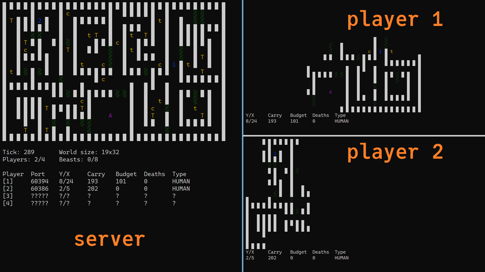

# TUI Multiplayer Game

A multiplayer terminal game written in C using threads and sockets.



## Gameplay
The main objective of the game is to collect as many coins (yellow "c", "t" and "T" objects) as possible and save them by going to the campsite (magenta "A"). Other players may kill each other (including you!), which will leave all your money on the ground (as a yellow "D") and let others collect it. There are also wild beasts, which randomly roam accross the world, but hunt for players when one is in sight.

Player's keyboard controls:
- wasd - move around
- Q, q - quit the game

Server's keyboard controls:
- c, t, T - add a coin, tresure or large treasure at a random location
- B, b - spawn a beast at a random location
- Q, q - quit the game, disconnecting all players and beasts


## Architecture
The game consists of:
- [Server](server.c) - Handles the game logic and connects all players together
- [Client](client.c) - A game client operated by a human player
- [Bot Client](bot-client.c) - Game client that plays autonomously using a very simple threat detection algorithm
- [Beast Client](beast-manager.c) - A server-side client that hunts for players and can be added on the server side

All the clients operate on the same API, which means that even the server-side beast clients don't get any advantage. Everyone reveals a 5 by 5 area around them and keeps track of any terrain discovered since joining the game.

Clients connect to the server using a websocket and communicates with a simple API which sends serialized map data to them. Beast clients are started as children of the server process, as they can't be run separately.

The server tries to handle every client's request asynchronously in separate threads. Keyboard handlers are also separate from the game loop and connection thread.

## Building
Generate build files:
```
cmake -B .
```
Then build binaries:
```
cmake --build build --target all
```
Binaries `server`, `client` and `bot-client` will be placed in the `build` directory.

## Running
You need to start the game server before any clients can connect. Up to 4 clients (including bot clients) can join the game session. New beasts are added by pressing `b` in the server window. Up to 8 beasts can be added. A client or server window can be closed by pressing `q`.

## Configuration
You can change the server's address and port in `config.h`. The map can be changed, but needs to be exported to the [ppm](http://davis.lbl.gov/Manuals/NETPBM/doc/ppm.html) image format. Included map files also have their respective `.xcf` (GIMP) project files. `ppm` files exported by GIMP need to be exported in ASCII mode and stripped from the "Created by GIMP version ..." comment in line 2.

Objects in map are identified by colors:
- `#ffffff` - empty tile
- `#000000` - wall
- `#00ff00` - bush
- `#ff00ff` - campsite

## Compatibility
This project was written and only tested on Linux. Movement controls in clients may not work on other terminals, as it uses the non-canonical immediate input mode. Keep in mind that it's known to work on KDE Konsole, Ubuntu Terminal and Microsoft Terminal when running in WSL, other terminals may malfunction. If you ever run into rendering issues, use the `reset` command in your shell to fix the terminal output.

Support for threading and sockets should also be noted, as the libraries used are platform-dependent and this code will not work under other platforms.
